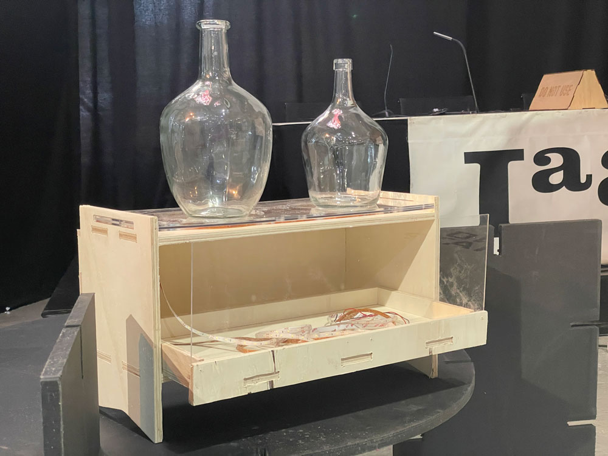
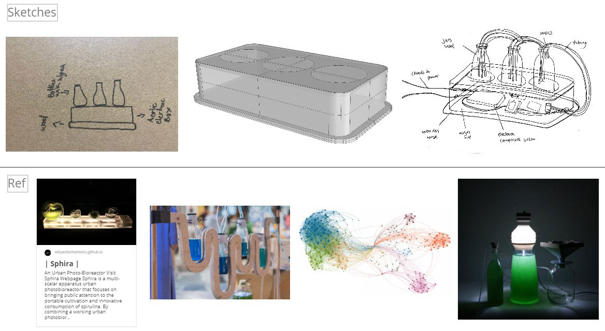
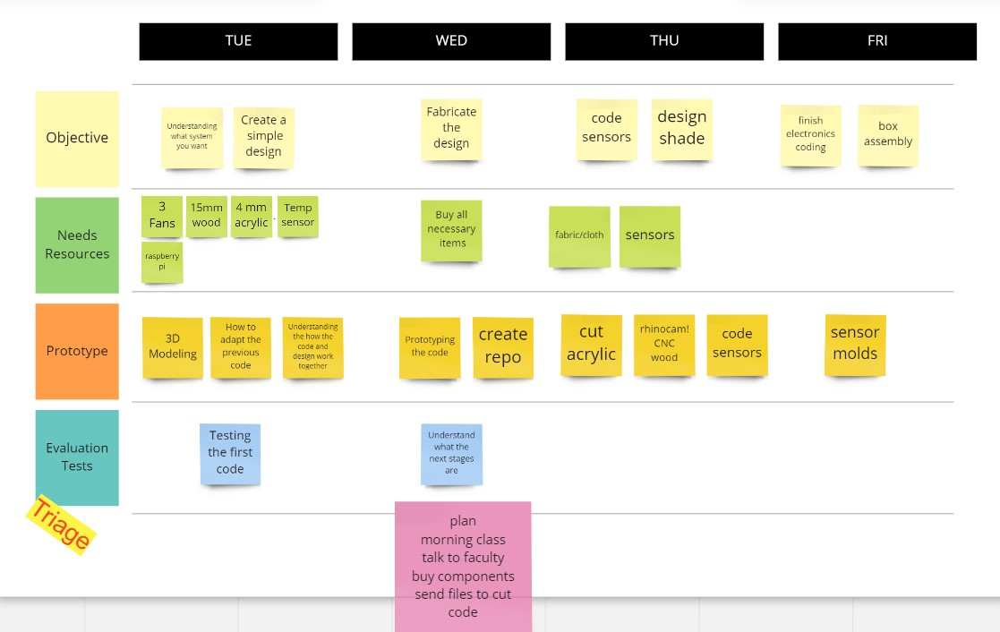
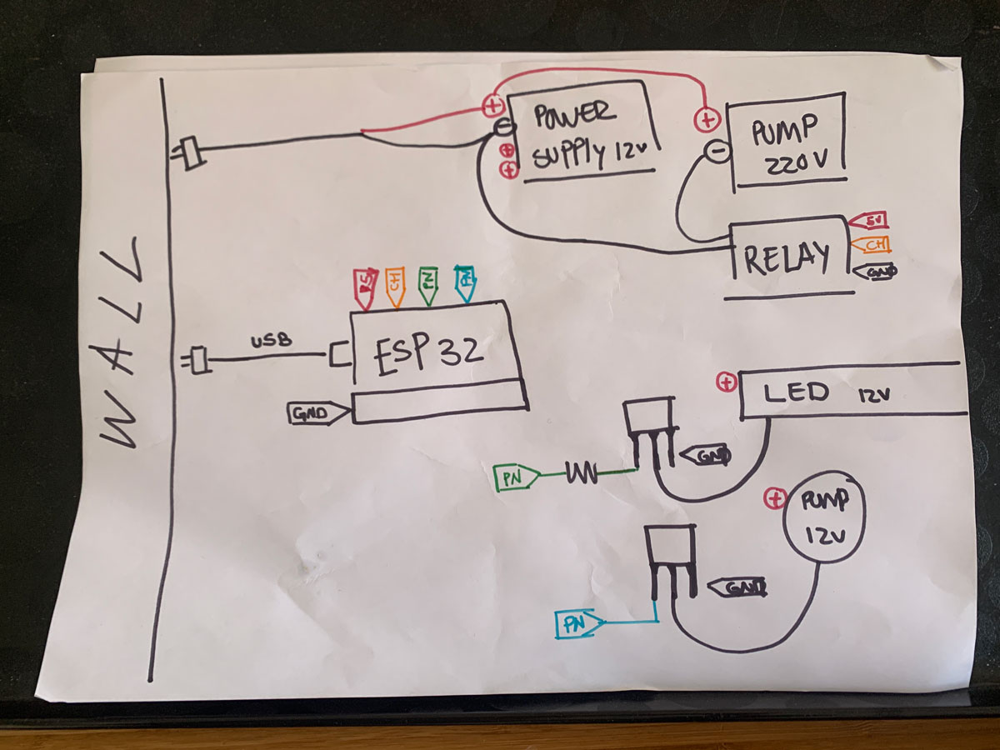
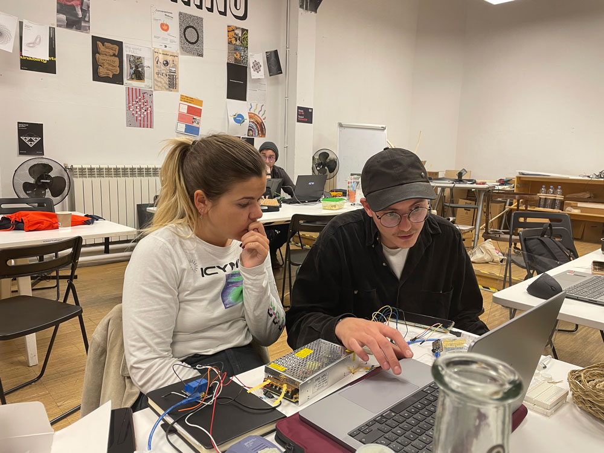
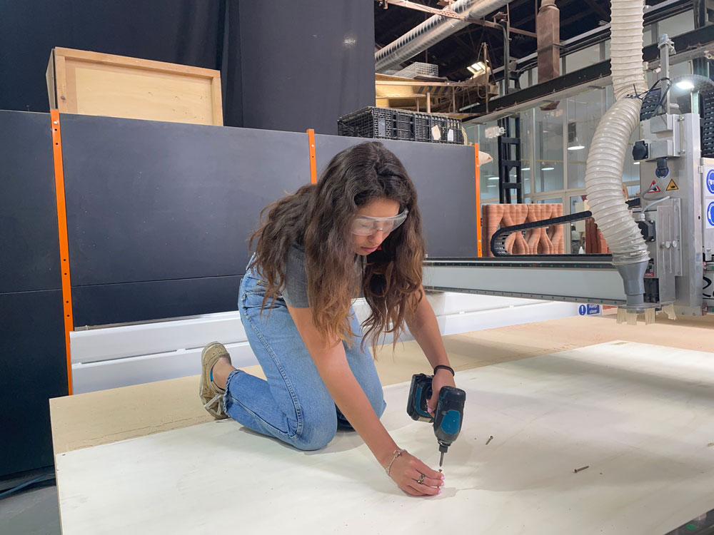
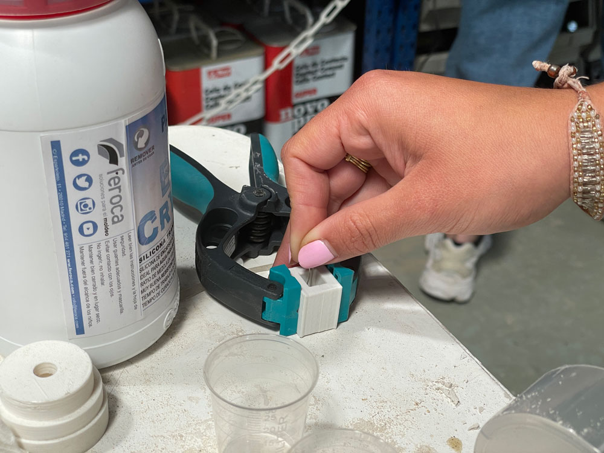
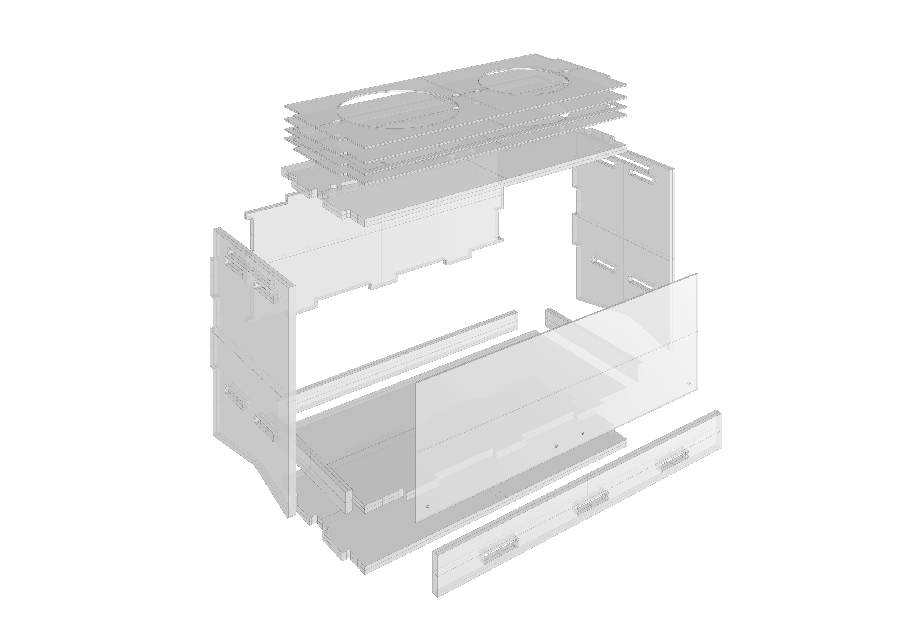
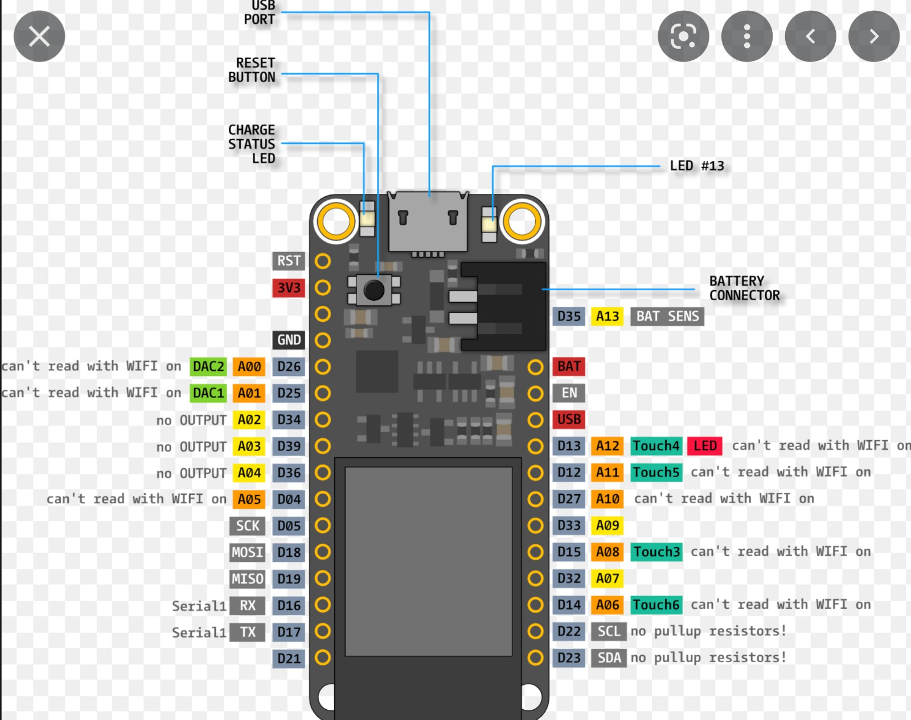

# Portable Photobioreactor
## FabAcademy Microchallenge 3
[Paula Del Rio Arteaga](https://paula-delrio-arteaga.github.io/mdef/),
[Pippa Formosa](https://philippa-formosa.github.io/mdefweb/),
[Marina Lermant](https://marina-lermant.github.io/mdef-website/)

Design and make an **ethical tool or artifact** that allows you to interact with others

Our updated photobioreactor will achieve these goals 
- allowing greater mobility and accessibility
- spreading information to larger audiences
- bringing people and living species together
- generating new ideas for nutrient intake
- understanding new ways of creating home agriculture
- Bioremediation of air

### Concept
This new and improved project is a second iteration of our photobioreator from microchallenge 2. This photobioreactor is a space for spirulina to thrive and grow in a controlled environment for cultivation.

### Why?
Though the previous photobioreactor worked well for demonstrative purposes and was more fun-looking in a visual way, we wanted to create one that was more functional. This PBR will be easier to transport, move around to different locations, and is more compact. It also includes a bottom component where a harvesting bottle can be stored.

### Purpose
The PBR maintains optimal conditions for spirulina by providing and monitoring the correct amount of light, temperature, and airflow. By using a light sensor, we are able to determine the density of the spirulina and its growth by the amount of light passage. The temperature sensor will tell us if the spirulina water is getting too cool. The pumps provide airflow by means of air bubbles and circulation. The removable caps allow the user to easily remove the top and tubes by taking it off to harvest. The data from the sensors will be sent to computers via wifi to be monitored.

### Plan And Execution
Before starting anything, we began by thinking back on the photobioreator1.0 and establishing what we wanted to change, modify, or keep the same. We then researched and looked for inspiration through other spirulina growing references we found. Some of these resources included Eduardo Chamorro’s project Sphira and a company for growing your own spirulina called spirulina society. We threw all of our ideas onto the miro board, wrote down a rough plan of what we would do each day of the week, and got started. Given the need for practicality and more complex electronics, we decided to make the design relatively simple compared to the previous one.

### Fabrication Process and Materials

#### Electronics

  - 2 huzzah feather ESP32
  - light sensors
  - temperature sensor
  - jumper wires
  - power source
  - LED lights with 10k resistor and mosfet
  - potentiometer for temperature
  - relay for air pumo
  - mosfter for persistaltic pump
  - 10k resistor for light sensor
  - air pump
  - peristaltic pump

References used 

- [ESP32 Light Sensor](https://esp32io.com/tutorials/esp32-light-sensor)
- [Thermistor with Arduino](https://www.e-tinkers.com/2019/10/using-a-thermistor-with-arduino-and-unexpected-esp32-adc-non-linearity/)
- [Thermistor Library](https://www.arduino.cc/reference/en/libraries/thermistorlibrary/)

#### Fabrication

- 2 large glass bottles
- 1 small glass harvesting bottles
- 3mm acrylic pane
- 2mm mdf sheet
- 12mm wood sheet
- tubing
- grow LED lights
- Tube connectors
- screws

We first designed the stand/box in rhino. The upper panels of acrylic and mdf were cut on the laser cutter while the drawer and structure of the box was cut using the CNC. 

The bottle caps were modeled and then 3D printed with flexible filament. After everything was cut, the pieces were sanded and assembled into a box. 
To create the sensor mold, it was first 3D printed, then hard silicone was poured in while the sensors were suspended. 

LED lights were inserted into the top panel to provide light to the bottles from below.

#### System Diagram

We added two sensors to the bread board and connected them to the circuit that we already had from the privious photobioreacrtor. 
Using proper resistor to each sensor. The sensor changes its value acording to the voltage recivied by the resistor. By declaring a threshold and some variables we were able to monitor our spirulina for the two main reasons; the spirulina could be damaged, too low or high temperature or too much direct sunlight during the high UV peak hours that are very comnon in BCN. Eventually when the temperature drops at night it will light our Grow LED lights and if the sunlight is too bright it would activate a servo motor to unroll a curtain for shade. 

#### Integrated Design
Interfaces server with the output values of our sensors : http://172.16.23.12/

#### Future Development Opportunities
With this photobioreator, we aim to be able to maintain a very controlled environment. Something that could help with this is adding a motorized shade that protects the bottles from direct sunlight when it gets too hot. We would need to add additional light sensors facing the outside of the box to detect the amount of sunlight coming in. We also thought about measuring C02 concentrations to see if the algae was in fact bioremediating the air.

#### Hiccups
- We did not have enough acrylic material to create enough space that we needed for the LEDs. In order to solve this, we created a fram from mdf that would act as a spacer.
- For the lid/caps, we originally wanted to print with flexible filament so that it could wrap around the top. It was not supported by the printer so we decided to print with PLA instead.
- Before cutting any of the design, we put the box together in the 3D model version to ensure everything would line up. We then adjusted the model accordingly
- The sensor molds were very finicky as they are small. We first printed a mold in PLA which stuck and ripped the silicone mold. As a second iteration, we printed one with flexi filament in a single-layered spiral print so that the mold would be easy to remove.
- The CNC did not cut through some parts of the box file because the wood thickness was thinner at the edges. We recut some of these parts and sanded down the rest.
- We faced some problems connecting the sensors due to mistaken librabries and sometimes the resistance wasn't the proper one. With the aid of a potentiomenter we are able to regulate the resistance to find a more stable value. The problem is that the tempature that it's sowing isn't accurate. But we have a threshold to at least calibrate it. 
- Debugging, when mergenig the codes for web server and the sensors we faced the problem that the signal emitted by the sensor was wrong. The problem comes from the microcontroller ESP32, which once it's connected to Wifi some of the pins aren't able to read. 

- Due to a long code we had to take in acount the importance of the order when placing different variables. 
- How to send the right value to the the webserver? By using the variable string. [Tutorial](https://www.tutorialspoint.com/arduino/arduino_strings.htm)

#### Open-source design and fabrication files
